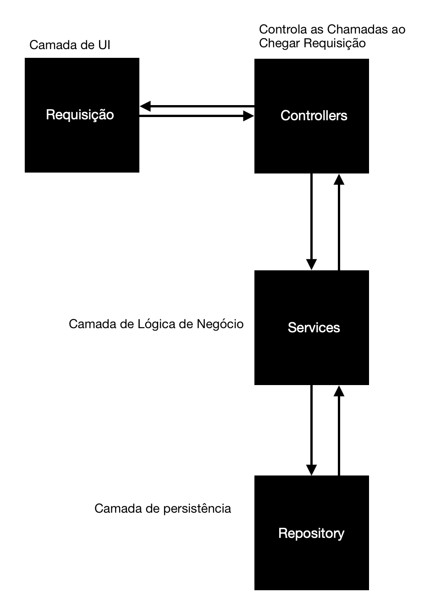
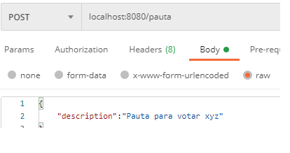
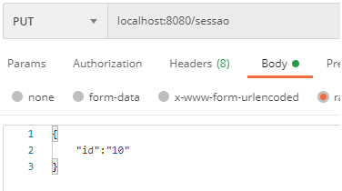
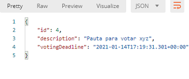
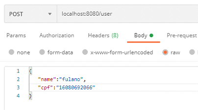
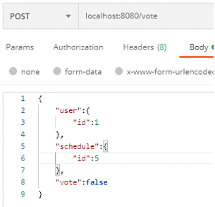
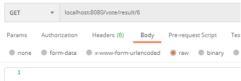
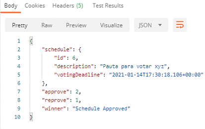

# API De Votos Com SpringBoot e Java
Esse documento é a especificação da API de votos
Esse relatório tem por objetivo demonstrar como 
foi pensada a criação da solução para o desafio proposto
de modelagem e implementação de um sistema de votos em pautas.
A estrutura do sistema ficou da seguinte forma:

A primeira camada da aplicação está representando o ponto de entrada aonde será 
feita a requisição para a API. O desenvolvimento consistiu somente da parte do
backend da aplicação. Na camada de persistência, foi usado o PostgreSQL, juntamente 
com a GUI do pgAdmin. Basta configurar um servidor com as informações contidas no arquivo
application.properties. A linguagem utilizada foi Java, juntamente do framework
SpringBoot, utilizei a JDK 17, mas não faço uso de nada específico, então deve funcionar em praticamente qualquer versão.

# Criando Uma Nova Sessão
Juntamente do projeto, estou enviando um arquivo postman com uma collection
a qual possui definições de requisições.
Para a criação de uma nova Pauta, deve-se utilizar um método POST, o
ID é gerado e incrementado automaticamente pelo framework. Exemplificado abaixo.

# Abrindo Uma Pauta em Uma Sessão
Existe a opção de passar uma data de prazo limite para uma sessão através do método
de criação da sessão. Porém, também pode-se passar a sessão com uma data vazia
e posteriormente fazer um método PUT possuindo as informações de prazo limite da seguinte forma:

O ID é necessário para saber qual sessão queremos iniciar. Por definição, o 
prazo da votação acaba em 1 minuto após sua criação para fins de teste da aplicação.
Então só vai ser possível votar no minuto em que a sessão está aberta.

Após isso, devemos criar os usuários que irão votar em uma sessão.
São criados da seguinte forma:

# Criando um Usuário
Para criar um usuário, é necessário passar um CPF válido na criação do usuário.
Está sendo validado o CPF através de uma classe no próprio projeto, onde foi 
definida a lógica de validação do mesmo. Para criar um usuário com um CPF válido,
é possível utilizar o seguinte site: https://www.4devs.com.br/gerador_de_cpf.

# Votando
Para votar, é necessário especificar o ID do usuário que está votando e o ID da
sessão em que ele irá votar, o voto é true ou false.

# Obtendo o Resultado dos Votos
Após o final padrão do tempo de votação, é possível utilizar um método GET para 
obter os resultados finais da votação:

# Resultados

# Testes Unitários
Para os testes unitários, foi utilizado a ferramenta Mockito e os testes 
se encontram em /src/test/java/com/tests/
